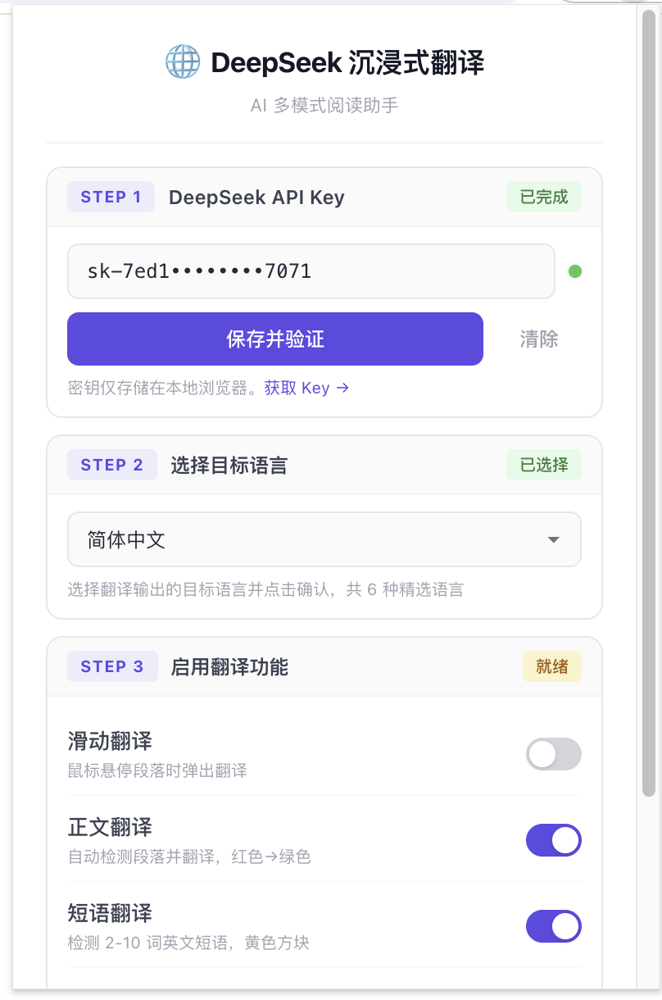
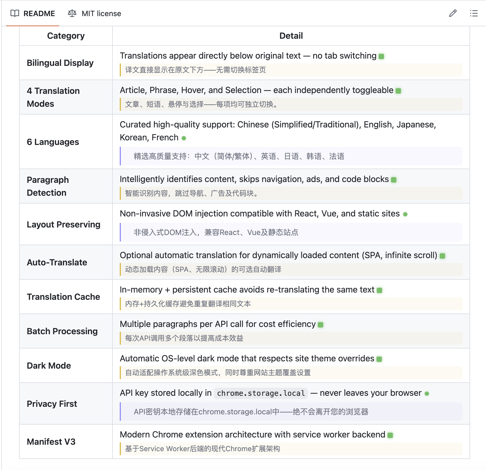
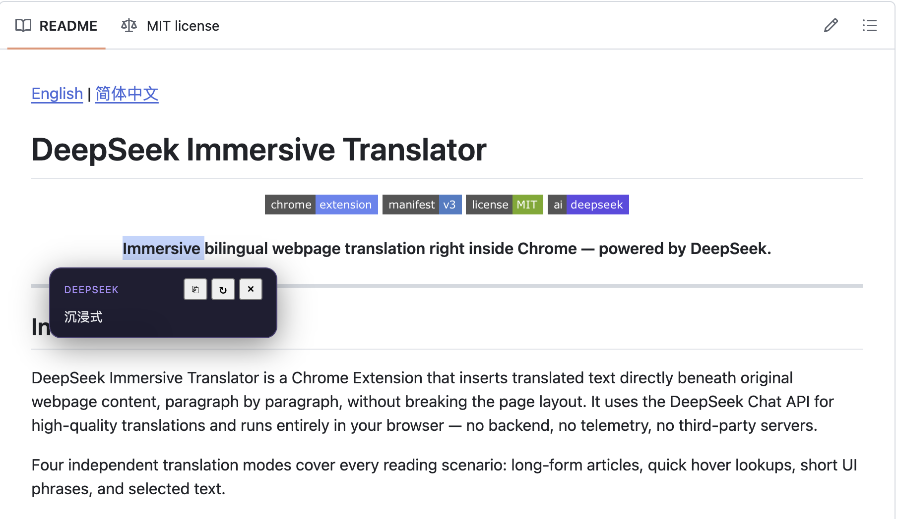

[English](./README.md) | [简体中文](./README.zh-CN.md)

# DeepSeek 沉浸式翻译器

<p align="center">
  
  
  
  
</p>

<p align="center">
  <strong>一款由 DeepSeek 驱动的沉浸式双语网页翻译 Chrome 扩展。</strong>
</p>

---

## 项目介绍

DeepSeek 沉浸式翻译器是一款 Chrome 浏览器扩展，能够在原始网页内容的段落下方直接插入对应的中文翻译，同时完整保留原始页面布局。它使用 DeepSeek Chat API 提供高质量翻译，所有计算全部在浏览器本地完成——无后端、无遥测、无第三方服务器。

扩展内置四种独立的翻译模式，覆盖全场景阅读需求：长文阅读、悬停速查、短词翻译、选中翻译。

---

## 功能特性

| 类别 | 说明 |
|------|------|
| **双语对照显示** | 译文直接显示在原文下方，无需切换标签页 |
| **四种翻译模式** | 正文翻译、短语翻译、滑动翻译、滑词翻译，可独立开关 |
| **13 种目标语言** | 中文、日语、韩语、法语、德语、西班牙语、葡萄牙语、俄语、阿拉伯语、越南语、泰语等 |
| **智能段落识别** | 自动识别正文内容，跳过导航栏、广告、代码块 |
| **保留原始布局** | 无侵入式 DOM 注入，兼容 React、Vue 和静态网站 |
| **动态内容翻译** | 可选的自动翻译 SPA 和无限滚动加载的新内容 |
| **双层翻译缓存** | 内存缓存 + chrome.storage 持久化缓存，避免重复翻译 |
| **批量 API 调用** | 多段落合并为单次 API 请求，大幅降低 API 费用 |
| **暗黑模式** | 自动跟随系统主题，同时适配网站手动切换的暗色主题 |
| **隐私优先** | API Key 仅存储在浏览器本地 `chrome.storage.local` 中 |
| **Manifest V3** | 现代 Chrome 扩展架构，Service Worker 后台 |

---

## 插件截图

<table>
  <tr>
    <td width="33%"></td>
    <td width="33%"></td>
    <td width="33%"></td>
  </tr>
  <tr>
    <td align="center"><b>设置面板</b><br>三步引导式配置 + 语言确认</td>
    <td align="center"><b>正文翻译</b><br>红色→绿色段落翻译指示器</td>
    <td align="center"><b>短语与滑动翻译</b><br>黄色方块 + 悬停弹窗</td>
  </tr>
</table>

---

## 安装教程

### 前提条件

- **Google Chrome** 或任意基于 Chromium 的浏览器（Edge、Brave、Arc）
- **DeepSeek API Key** — [在 platform.deepseek.com 获取](https://platform.deepseek.com/api_keys)

### 方法一 — 加载未打包扩展（源码安装）

适合开发者与尝鲜用户。

```bash
git clone https://github.com/FistHeart/DeepSeek-Immersive-Translator.git
```

1. 打开 Chrome，访问 `chrome://extensions/`
2. 打开右上角的 **开发者模式** 开关
3. 点击 **加载已解压的扩展程序**
4. 选择克隆下来的 `DeepSeek-Immersive-Translator` 文件夹
5. 扩展图标将出现在 Chrome 工具栏中

### 方法二 — ZIP 发布包安装

适合无需 git 的普通用户。

1. 从 [GitHub Releases](https://github.com/FistHeart/DeepSeek-Immersive-Translator/releases) 下载最新的 `DeepSeek-Immersive-Translator-vX.Y.Z.zip`
2. 解压 ZIP 文件到本地文件夹
3. 打开 Chrome → `chrome://extensions/` → 开启 **开发者模式**
4. 点击 **加载已解压的扩展程序**，选择解压后的文件夹

### 方法三 — CRX 拖拽安装

适合本地快速安装与测试。

1. 从 [GitHub Releases](https://github.com/FistHeart/DeepSeek-Immersive-Translator/releases) 下载最新的 `DeepSeek-Immersive-Translator-vX.Y.Z.crx`
2. 打开 Chrome → `chrome://extensions/`
3. 将 `.crx` 文件拖入扩展管理页面
4. 点击 **添加扩展程序** 确认安装

---

## 使用说明

1. 点击 Chrome 工具栏中的扩展图标 
2. 在弹窗面板中，开启你需要的翻译模式：
   - **正文翻译** — 全页面段落翻译
   - **短语翻译** — 短词检测与翻译
   - **滑动翻译** — 鼠标悬停翻译
   - **滑词翻译** — 选中文字翻译
3. 从下拉菜单中选择目标语言
4. 打开任意网页，翻译会根据你开启的模式自动开始

---

## DeepSeek API 配置

本扩展使用 **你自己的** DeepSeek API Key。无代理、无共享额度。

### 获取 API Key

1. 访问 [platform.deepseek.com/api_keys](https://platform.deepseek.com/api_keys)
2. 注册或登录
3. 创建一个新的 API Key（以 `sk-` 开头）
4. 复制 Key

### 在扩展中配置

1. 点击工具栏中的扩展图标
2. 将 API Key 粘贴到输入框中
3. 点击 **保存 Key**
4. 状态指示灯变绿即表示 Key 有效，可以开始使用

### Key 存储说明

- API Key **仅** 存储在 `chrome.storage.local` 中（Chrome 静态加密）
- **绝不** 发送至除 `https://api.deepseek.com` 以外的任何服务器
- 内容脚本无法直接访问 Key——所有 API 调用均通过后台 Service Worker 中转
- 卸载扩展后 Key 将被永久删除

---

## 翻译模式说明

### 1. 正文翻译

自动检测文章段落并在每段下方插入翻译。适用于新闻、博客、技术文档等长篇内容。

- **开启方式**：在弹窗中开启「正文翻译」
- **触发行为**：已检测段落显示红色圆点 → 自动批量翻译 → 完成后变为绿色圆点
- **交互方式**：点击红色圆点触发翻译，点击绿色圆点折叠译文，再次点击恢复（使用缓存）
- **性能设计**：批量 API 调用、IntersectionObserver 视口感知懒加载、卡死翻译看门狗恢复

### 2. 短语翻译

检测文章段落**之外**的短英文短语（2–10 词）——UI 标签、技术术语、图注文字、卡片标题等。

- **开启方式**：在弹窗中开启「短语翻译」
- **触发行为**：短语旁显示黄色小方块 → 点击翻译 → 完成后变为绿色方块
- **交互方式**：点击黄色方块展开翻译（缓存优先），点击绿色方块折叠（缓存保留），翻译框内置刷新按钮支持超时恢复
- **模块隔离**：完全独立的模块——绝不与正文翻译区域（`[data-ds-art]` 元素）重叠

### 3. 滑动翻译

鼠标悬停任意段落即可弹出翻译浮窗。适合快速查阅，无需开启整页翻译。

- **开启方式**：在弹窗中开启「滑动翻译」
- **触发行为**：鼠标悬停段落 250ms → Shadow DOM 浮窗出现在光标附近
- **交互方式**：自动跟随光标定位，移开后自动隐藏，内置刷新按钮可重新翻译
- **性能设计**：缓存优先策略——已翻译文本毫秒级显示

### 4. 滑词翻译

选中页面上任意文字即可翻译。支持短语、句子、短段落（3–4000 字符）。

- **开启方式**：在弹窗中开启「滑词翻译」
- **触发行为**：选中文字 → 浮窗出现在选区附近
- **交互方式**：复制按钮一键复制译文，刷新按钮重新翻译，点击浮窗外任意位置关闭
- **性能设计**：缓存优先，重复选中相同内容即时显示

---

## 项目结构

```
DeepSeek-Immersive-Translator/
├── manifest.json                  # 扩展清单（Manifest V3）
├── background.js                  # Service Worker — API 网关与 Key 管理
├── content.js                     # 内容脚本入口 — 模式分发
├── popup.html / popup.css / popup.js  # 扩展弹窗界面
├── lib/
│   ├── utils.js                   # 工具函数：防抖、重试、内容区域判断
│   ├── storage.js                 # chrome.storage.local 封装
│   ├── dom-handler.js             # 安全 DOM 注入、页面就绪检测
│   ├── readability-engine.js      # 正文区域评分与识别
│   ├── content-classifier.js      # 文本分类器：忽略/短语/段落
│   ├── translation-cache.js       # 双层缓存（内存 + chrome.storage）
│   ├── translation-queue.js       # 批量翻译队列
│   ├── translator.js              # 翻译引擎（单条 + 批量）
│   ├── dom-scanner.js             # 站点适配段落扫描器
│   ├── viewport-manager.js        # 视口感知内容观察
│   ├── popup-position-engine.js   # 浮窗位置计算
│   ├── paragraph-indexer.js       # 段落索引（批量操作）
│   ├── paragraph-state-manager.js # 红/绿圆点状态机
│   ├── translation-watchdog.js    # 卡死翻译恢复
│   ├── hover-popup.js             # 滑动翻译模式
│   ├── article-translator.js      # 正文翻译模式
│   ├── selection-translator.js    # 滑词翻译模式
│   ├── phrase/                    # 短语翻译模块（7 个文件）
│   │   ├── phrase-cache-manager.js    # 专用 LRU 缓存
│   │   ├── phrase-detector.js         # 2–10 词短语检测引擎
│   │   ├── phrase-renderer.js         # 黄/绿方块 + 翻译框渲染
│   │   ├── phrase-translator.js       # 翻译请求（取消 + 超时）
│   │   ├── phrase-lifecycle.js        # 状态机 + 点击处理
│   │   ├── phrase-module.js           # 模块入口 + 观察器
│   │   └── phrase.css                 # 短语专用样式
│   ├── adapters/                  # 站点适配器
│   │   ├── generic.js / reddit.js / twitter.js / medium.js / arxiv.js
│   └── content.css                # 文章翻译与段落指示器样式
├── icons/                         # 扩展图标（16 / 48 / 128 px）
├── scripts/
│   └── build.js                   # 发布构建流水线
├── package.json                   # NPM 脚本
├── README.md                      # 英文文档
├── README.zh-CN.md                # 中文文档（本文件）
├── LICENSE
└── .gitignore
```

---

## 构建方式

项目包含零依赖的构建流水线，可生成可分发的发布包。

```bash
# 完整构建：ZIP + CRX
npm run build

# 仅构建 ZIP（用于 Chrome Web Store 上传）
npm run build:zip

# 仅构建 CRX（用于本地拖拽安装）
npm run build:crx

# 仅校验 manifest.json
npm run prebuild
```

### 构建要求

- **Node.js** ≥ 16（仅使用内置模块，零 npm 依赖）
- **Git** — 用于通过 `git archive` 生成干净的 ZIP
- **Google Chrome** — 用于通过 `--pack-extension` 生成 CRX

---

## 打包发布

构建脚本从 `manifest.json` 自动读取版本号，输出：

```
dist/
├── DeepSeek-Immersive-Translator-v5.5.0.zip   ← 可直接上传 Chrome Web Store
└── DeepSeek-Immersive-Translator-v5.5.0.crx   ← 可拖入 chrome://extensions 安装
```

**ZIP** 通过 `git archive` 生成，自动排除开发文件（`.git`、`.DS_Store`、IDE 配置、日志、临时文件）。`manifest.json` 位于 ZIP 根目录，可直接上传至 Chrome Web Store。

**CRX** 通过 Chrome 原生 `--pack-extension` 生成。首次构建会在项目根目录创建 `key.pem` 私钥——保留此文件以保持每次构建扩展 ID 一致（已加入 `.gitignore`）。

---

## 隐私与安全

本扩展实现了 **零泄露架构**：

| 层级 | 机制 |
|------|------|
| **存储** | `chrome.storage.local` — Chrome 静态加密 |
| **访问** | 仅 `background.js`（Service Worker）可读取 API Key |
| **传输** | API Key 仅通过 HTTPS 发送至 `https://api.deepseek.com` |
| **隔离** | 内容脚本绝不直接持有 Key — 通过 `chrome.runtime.sendMessage` 请求翻译 |
| **界面** | Key 输入框被掩码；已保存的 Key 在弹窗中被混淆显示 |

- 无分析、无追踪器、无开发者后端
- API Key 仅存储在你的浏览器配置文件中
- 卸载扩展后 Key 被永久删除
- 源代码中不含任何凭据——可安全公开发布到 GitHub

---

## 支持的语言

| 代码 | 语言 |
|------|------|
| `zh-CN` | 中文（简体） |
| `zh-TW` | 中文（繁體） |
| `en` | English |
| `ja` | 日本語 |
| `ko` | 한국어 |
| `fr` | Français |

---

## 开发路线图

- [x] 双语段落注入
- [x] DeepSeek API 集成
- [x] 翻译缓存（内存 + 持久化）
- [x] 批量翻译处理
- [x] 暗黑模式（系统级 + 网站 class 检测）
- [x] SPA / 无限滚动动态内容自动翻译
- [x] 短语翻译模式（2–10 词检测，黄/绿方块指示器）
- [x] 发布构建流水线（ZIP + CRX）
- [x] 截图与演示 GIF
- [ ] 自定义翻译提示
- [ ] PDF 页面翻译
- [ ] Firefox 扩展支持
- [ ] 离线翻译词汇表

---

## 贡献

欢迎贡献代码。

1. Fork 本仓库
2. 创建功能分支（`git checkout -b feature/amazing-feature`）
3. 进行修改
4. 提交 Pull Request

如有 Bug 或功能建议，请 [提交 Issue](https://github.com/FistHeart/DeepSeek-Immersive-Translator/issues)。

---

## 开源协议

MIT 许可证 — 详见 [LICENSE](./LICENSE)。

---

## 免责声明

本扩展与 DeepSeek 官方无关。你需要自行承担 API 用量及相关费用。本软件按原样提供，不提供任何保证。
